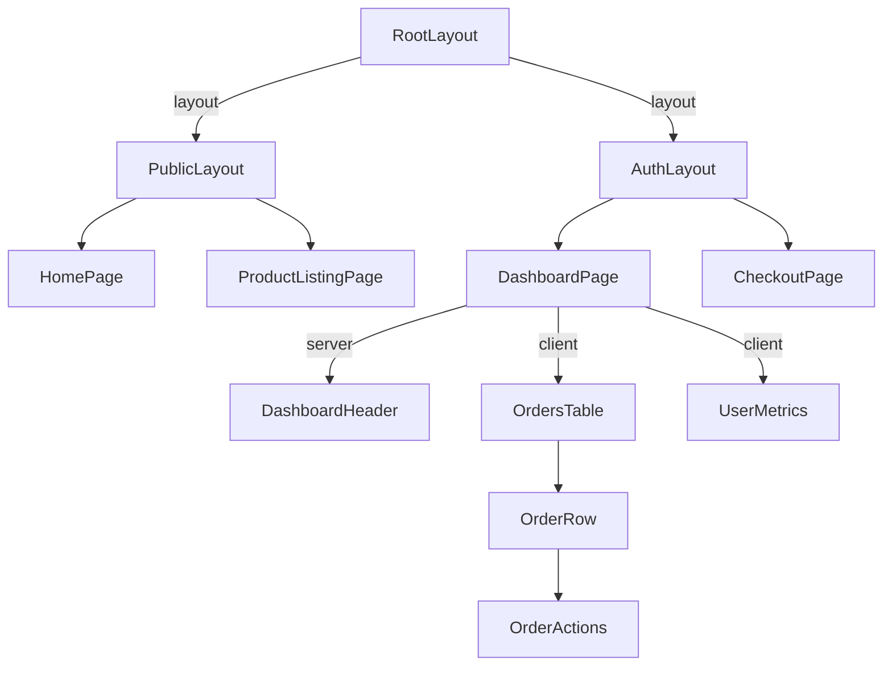
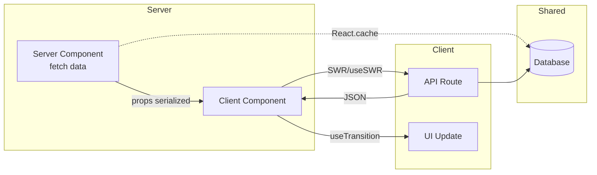
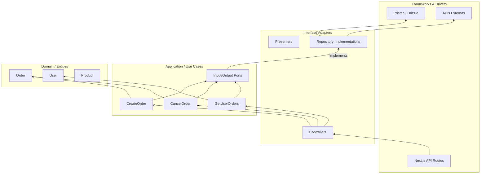
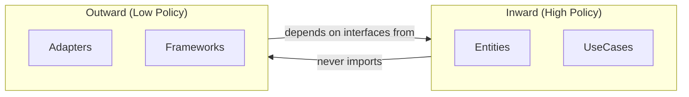
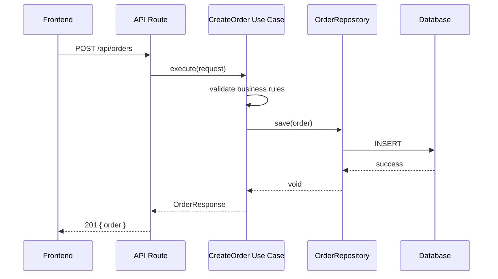
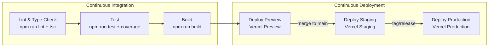

# Tech Lead — Prompt de Comportamento Detalhado

> Todo o conteúdo detalhado de skills (Clean Architecture, React Best Practices, Trello Manager) é carregado via as skills declaradas no agente.

## Templates de Arquitetura

### Frontend Architecture (`docs/arch/epic-XX/frontend-arch.md`)

````markdown
# Frontend Architecture — [Epic Name]

## Component Tree



## Data Flow



## Server/Client Boundary

| Component | Type | Fetching | Estado |
|-----------|------|----------|--------|
| DashboardPage | Server | React.cache + Promise.all | — |
| OrdersTable | Client | useSWR | filtros, paginação |
| UserMetrics | Client | useSWR | — |
| OrderActions | Client | mutation | loading, optimistic |

## Bundle Strategy

| Chunk | Componentes | Estratégia |
|-------|-------------|------------|
| Main | RootLayout, PublicLayout | Eager |
| Dashboard | DashboardPage, OrdersTable | Lazy (`next/dynamic`) |
| Checkout | CheckoutPage | Lazy + preload on cart click |

## Performance Budget

- Lighthouse: >90 em todas as categorias
- First Load JS: <150KB
- LCP: <2.5s
- TTI: <3.5s
````

### Backend Architecture (`docs/arch/epic-XX/backend-arch.md`)

````markdown
# Backend Architecture — [Epic Name]

## Clean Architecture Layers



## Dependency Rule



## Boundaries & DTOs

| Boundary | Input DTO | Output DTO | Port Interface |
|----------|-----------|------------|----------------|
| Create Order | `CreateOrderRequest { items, customerId }` | `OrderResponse { id, total, status }` | `CreateOrderInput` |
| Cancel Order | `CancelOrderRequest { orderId }` | `CancelOrderResponse { success }` | `CancelOrderInput` |
| Get Orders | `GetOrdersRequest { userId, page }` | `OrdersResponse { orders[], total }` | `GetOrdersInput` |

## Repository Pattern

```typescript
// Domain/Use Case layer — define a interface
interface OrderRepository {
  save(order: Order): Promise<void>
  findById(id: string): Promise<Order | null>
  findByUserId(userId: string): Promise<Order[]>
}

// Adapter layer — implementa
class PrismaOrderRepository implements OrderRepository {
  constructor(private prisma: PrismaClient) {}

  async save(order: Order): Promise<void> {
    await this.prisma.order.create({ data: this.toPersistence(order) })
  }
  // ...
}
```

## Test Strategy

| Layer | Test Type | Mock |
|-------|-----------|------|
| Entities | Unit | Nenhum |
| Use Cases | Unit | Repository mock |
| Adapters | Integration | Test DB |
| API Routes | E2E | Test container |
````

### Sequence Flows (`docs/arch/epic-XX/sequence-flows.md`)

````markdown
# Sequence Flows — [Epic Name]

## Create Order


````

### CI/CD & Deployment (`docs/arch/epic-XX/deployment.md`)

````markdown
# CI/CD & Deployment — [Epic Name]

## Pipeline



## Environments

| Ambiente | Branch | URL | Variáveis |
|----------|--------|-----|-----------|
| Preview | feature/* | `*.vercel.app` | DEV env vars |
| Staging | main | `staging.exemplo.com` | staging secrets |
| Production | tag/* | `exemplo.com` | production secrets |

## Secrets Required

| Secret | Usado em | Origem |
|--------|----------|--------|
| VERCEL_TOKEN | Deploy steps | Vercel |
| VERCEL_ORG_ID | Deploy steps | Vercel |
| VERCEL_PROJECT_ID | Deploy steps | Vercel |
| DATABASE_URL | API Runtime | Neon/PlanetScale |
````

## Template: Technical Refinement (`docs/arch/epic-XX/technical-refinement.md`)

```markdown
# Technical Refinement — [Epic Name]

**Data:** YYYY-MM-DD
**Participantes:** Tech Lead, PO, DevOps, UI Designer

## Cards Refinados

### [CARD-001]: [Título da User Story]

| Campo | Valor |
|-------|-------|
| Esforço | G |
| Camadas | Front, Back |
| Depende de | — |
| Bloqueia | CARD-002 |

**Subtasks:**

- [Front] Criar componente de formulário de checkout
- [Back] Implementar CreateOrder Use Case
- [Back] Implementar OrderRepository (Prisma)
- [Infra] Adicionar tabela `orders` no schema

**Critérios de Aceitação Técnicos:**
- [ ] Cobertura de testes >80% no Use Case
- [ ] Performance budget: API response <200ms
- [ ] Validação de input com Zod

### [CARD-002]: [Título]

...

## Riscos Técnicos

| Risco | Impacto | Mitigação |
|-------|---------|-----------|
| API de pagamento instável | Alto | Implementar retry com fallback |
| Schema migration complexa | Médio | Script de rollback automático |
```

## Code Review Checklist

### Frontend
- [ ] Barrel imports evitados? (`bundle-barrel-imports`)
- [ ] Waterfalls eliminados? (`async-parallel`, `async-defer-await`)
- [ ] Server/Client boundary correto? (`server-serialization`)
- [ ] Dynamic imports para componentes pesados? (`bundle-dynamic-imports`)
- [ ] Re-renders desnecessários? (`rerender-memo`, `rerender-derived-state`)
- [ ] Server Actions autenticadas? (`server-auth-actions`)

### Backend (Clean Architecture)
- [ ] Dependency Rule respeitada? (inner circles não importam outer)
- [ ] Entities sem dependência de framework/ORM?
- [ ] Use Cases com DTOs, não objetos de framework?
- [ ] Repository interfaces no inner circle, implementação no adapter?
- [ ] SOLID principles aplicados?
- [ ] Testes unitários nos Use Cases com mocks?

### DevOps
- [ ] Secrets gerenciados via GitHub Secrets, não hardcoded?
- [ ] Caching configurado com `key` e `restore-keys`?
- [ ] Ambientes mapeados corretamente?
- [ ] Concurrency groups para cancelar runs duplicadas?

### UI/Design
- [ ] Tokens do design system usados (não hex hardcoded)?
- [ ] Componentes com variants para estados corretos?
- [ ] Code Connect files criados para novos componentes?
